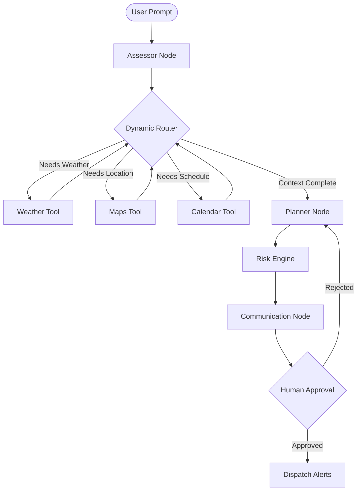

# Lifeline AI

Lifeline AI is an autonomous, multi-agent concierge designed to handle logistical disruptions. Built for the Google × Kaggle AI Agents Intensive Capstone, it uses Google's Gemini models to assess crises, orchestrate external API tools (such as mapping, weather, and calendars), evaluate risk, and draft stakeholder communications.

---

## Problem Statement

When unexpected logistical disruptions occur—like a cancelled flight or sudden weather event—individuals must manually navigate across various data sources to find alternatives, assess the impact on their schedule, and notify affected parties. This process is time-consuming, fragmented, and stressful.

---

## Solution

Lifeline AI addresses this by acting as an autonomous orchestrator. Instead of relying on manual lookup, the agent ingests a natural language description of the disruption, decides which APIs to query for missing context, and formulates an end-to-end recovery plan. It identifies schedule conflicts, factors in environmental variables, and prepares communications for human review.

---

## Features

### Implemented Features

- ✅ Incident analysis (LLM-based text extraction and classification)
- ✅ Weather integration (OpenWeather API for local conditions)
- ✅ Google Maps integration (Routing, geolocation, and nearby services)
- ✅ Calendar conflict detection (Google Calendar event parsing)
- ✅ Risk assessment (Quantitative risk scoring based on aggregated data)
- ✅ Communication drafting (Email and message templates)
- ✅ Streamlit dashboard (Real-time agent state visualization)
- ✅ Demo mode (Deterministic mock data without requiring API keys)
- ✅ Local state persistence (Session tracking in `.lifeline_sessions/`)

### Future Enhancements

- ⬜ OAuth2 integration for authenticated Google Calendar modifications
- ⬜ Integration with real-time flight status APIs
- ⬜ Multi-user session management
- ⬜ Direct API hook for sending emails/messages post-approval

---

## Architecture

Lifeline AI uses a stateful, dynamic agent graph pattern. Rather than executing a rigid, linear script, the core agent uses a routing node to determine its next action based on current state and missing context.



### Components

- **Assessor Node:** Parses the initial prompt to classify the incident type and extract entities.
- **Dynamic Router:** Decides which tools need to be executed based on the `AgentState`.
- **Tools (Weather, Maps, Calendar):** Asynchronous API wrappers that retrieve environmental and scheduling context.
- **Planner Node:** Synthesizes the gathered context into actionable logistical alternatives.
- **Risk Engine:** Normalizes the disruption parameters into an executive risk score (0-100).
- **Communication Node:** Generates tailored messages for stakeholders.
- **Human-in-the-Loop (HITL):** Awaits user review via the Streamlit interface before finalizing actions.

---

## Technology Stack

| Component | Technology | Use Case |
| :--- | :--- | :--- |
| Core Language | Python 3.11+ | Primary application logic |
| LLM Reasoning | Google Gemini 1.5 Pro | Agent orchestration and text synthesis |
| Data Validation | Pydantic | State management and strict schema definition |
| Web Framework | Streamlit | Reactive frontend and state visualization |
| Asynchronous I/O | `asyncio`, `httpx` | Non-blocking API requests |
| External APIs | Google Maps, OpenWeather | Contextual data retrieval |

---

## Project Structure

```text
lifeline/
├── app.py                 # Streamlit UI and session management
├── agent_graph.py         # Agent orchestration and node execution
├── mcp_tools.py           # External tool integrations (Maps, Weather, Calendar)
├── schema.py              # Pydantic data models for state tracking
├── config.py              # Application configuration
├── requirements.txt       # Python dependencies
├── Dockerfile             # Container configuration
├── .env.example           # Example environment variables
├── .lifeline_sessions/    # Locally persisted session JSON files
└── tests/                 # Unit and integration tests (pytest)
```

- `schema.py`: Pydantic models defining the `AgentState` and various data structures.
- `agent_graph.py`: The core state machine and reasoning loop.
- `mcp_tools.py`: Asynchronous clients for external integrations.
- `app.py`: Streamlit frontend that renders the agent's workflow.
- `tests/`: Asynchronous unit tests validating tools and graph logic.

---

## Installation

1. **Clone the repository:**
   ```bash
   git clone https://github.com/Hatim283/lifeline-AI.git
   cd lifeline-AI
   ```

2. **Initialize a virtual environment:**
   ```bash
   python -m venv venv
   source venv/bin/activate  # On Windows use `venv\Scripts\activate`
   ```

3. **Install dependencies:**
   ```bash
   pip install -r requirements.txt
   ```

4. **Set up configuration:**
   ```bash
   cp .env.example .env
   ```

---

## Environment Variables

Edit the `.env` file and populate it with the required keys:

- `GEMINI_API_KEY`: Required. Your Google Gemini API key for core reasoning.
- `OPENWEATHER_API_KEY`: Required. Used by the Weather Tool to fetch live meteorological data.
- `GOOGLE_MAPS_API_KEY`: Required. Used by the Maps Tool for geocoding and routing.
- `GOOGLE_CALENDAR_CREDENTIALS`: Optional. Path to a GCP service account JSON file for calendar synchronization.

---

## Running the Application

### Local

Run the application directly using Streamlit:

```bash
streamlit run app.py
```

Navigate to `http://localhost:8501` in your browser.

### Docker

Build and run the container locally:

```bash
docker build -t lifeline-ai .
docker run -p 8501:8501 --env-file .env lifeline-ai
```

### Google Cloud Run

Deploy directly to Google Cloud Run using the `gcloud` CLI:

```bash
gcloud run deploy lifeline-ai \
  --source . \
  --region us-central1 \
  --allow-unauthenticated \
  --set-env-vars="GEMINI_API_KEY=your_key,OPENWEATHER_API_KEY=your_key,GOOGLE_MAPS_API_KEY=your_key"
```

---

## Demo Mode

If you do not have access to the required API keys, you can still test the application logic. Toggling "Enable Demo Mode" in the sidebar will bypass external API calls and inject deterministic mock data. This allows you to evaluate the UI, agent state transitions, and generated communications for predefined scenarios (e.g., flight cancellation, medical emergency).

---

## Example Workflow

1. **Input:** The user submits: *"My flight EK001 from Dubai to London just got cancelled."*
2. **Assessment:** The agent classifies this as a `Flight Delay` and extracts the locations.
3. **Routing & Tool Execution:** The router queries the Weather Tool (detecting storms in Dubai) and the Calendar Tool (finding a scheduled meeting in London).
4. **Planning:** The planner generates alternative flight options that arrive before the meeting.
5. **Risk Assessment:** A risk score of `85` is generated due to the severe weather and critical meeting conflict.
6. **Communication:** An email draft is prepared to notify the meeting participants of the delay.
7. **Output:** The agent pauses and presents the proposed plan and draft message in the UI for human approval.

---

## Screenshots


*(Note: Add actual screenshots to the `docs/` folder in your repository to replace these placeholders).*

---

## Testing

The project uses `pytest` and `pytest-asyncio` for test execution.

To run the test suite:

```bash
pytest tests/ -v
```

---

## Limitations

- **Prototype:** This is a demonstration project built for an educational capstone.
- **External Dependencies:** The system relies on third-party APIs which may experience rate limits or failures.
- **Human Verification Required:** The system generates plans and communications based on LLM reasoning. A human must verify all actions before executing them.
- **Not for Emergencies:** This application is not intended for real-world emergency response or life-critical decision making.

---

## Future Work

- Implement OAuth2 flow for native Google Calendar integration.
- Expand test coverage for complex edge cases in the dynamic router.
- Implement robust retry mechanisms and exponential backoff for API calls.
- Add support for localized natural language processing outside of English.

---

## Contributing

Contributions are welcome. Please ensure that you:
1. Fork the repository.
2. Create a feature branch (`git checkout -b feature/your-feature`).
3. Ensure all tests pass (`pytest`).
4. Submit a Pull Request detailing your changes.

---

## License

This project is licensed under the MIT License.

---

## Acknowledgements

- Google Gemini
- Streamlit
- Pydantic
- Google Maps
- OpenWeather
- Google × Kaggle AI Agents Intensive
